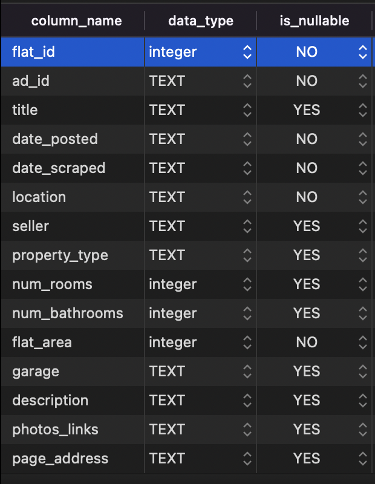
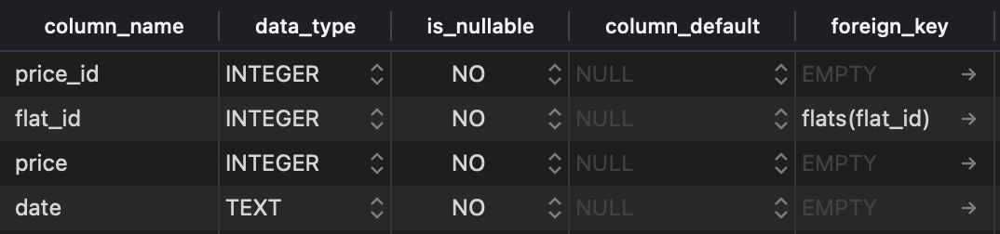

All the data gathered comes from [gumtree.pl](www.gumtree.pl). The whole code is available here [GitHub repo](https://github.com/mbalcerzak/mab_szuka_mieszkania).


Issues with data gathering (marked on the image above):  
1. Heavy storm, internet problems
2. Moving flats
3. Internet issues while I was away for the whole month
4. Gumtree closed in Poland


## Raspberry Pi
----

- I set up the scraper on a **Raspberry Pi 3B**
- It was being triggered by a **CRONJOB** every hour 
- Every week the scheduled script was uploading an SQLite file on my Google Drive as a **back-up**.

Initially I made it send me an email every evening with a simple report to check if it works.  

## Scrapy & BeautifulSoup
----

I was interested in obtaining as much information from each ad as possible. On top of all the flat characteristics I was also regularly checking the **price changes** to check if any price changed significantly.

```python

class BlogSpider(scrapy.Spider):
    name = "gumtree"

    with open('../start_urls.json', 'r') as f:
        start_urls = json.load(f)

    def parse(self, response):
        try:
            conn = sqlite3.connect('../data/flats.db')
            cursor = conn.cursor()
        except sqlite3.Error as e:
            raise Exception

        latest_prices = get_latest_prices_json()
        today = date.today().strftime("%Y-%m-%d")
        
        if latest_prices['date'] != today:
            raise Exception("Update 'latest price JSON' ")

        for flat_ad in response.css('div.tileV1'):
            page_address = get_page_address(flat_ad)
            ad_price = get_ad_price(flat_ad)
            ad_id = get_ad_id(page_address)

            if ad_id in latest_prices:
                try:
                    if int(latest_prices[ad_id]) != int(ad_price):
                        update_price(cursor, ad_id, ad_price, conn)
                except ValueError:
                    print(f"Wrongly put price: {ad_price}")
            else:
                add_flat(page_address, cursor, conn)

        try:
            next_page = get_next_page(response)
            get_page_info(next_page)
            conn.close()

            if next_page is not None:
                yield response.follow(next_page, self.parse)

        except KeyError:
            print(info_scraped_today(cursor))
            print("We reached our 50 pages")

```

I found each element on the page and loaded it into the database

```python

def get_ad_price(flat) -> int:
    """Find price information"""
    price = flat.css('span.ad-price::text').get()
    price = re.sub("[^\d\.,]", "", price)
    return price

```

Before each run of the scraper I was updating the list of latest price of each flat. If the current price was differnt from the most recent from the table, a new record was created with a timestamp.

```python

def query_latest_price(cursor) -> dict:
    json_prices = {}

    query = """ 
            SELECT max(price_id) AS max_id, ad_id, price
            FROM prices
            LEFT JOIN flats ON flats.flat_id = prices.flat_id
            GROUP BY ad_id
            """

    cursor.execute(query)
    latest_prices = cursor.fetchall()

    for row in latest_prices:
        flat_id = str(row[1])
        price = row[2]
        json_prices[flat_id] = price

    today = date.today().strftime("%Y-%m-%d")
    json_prices['date'] = today

    return json_prices

```

# Database design
---

I can safly say that the database is now ni [Third Normal Form](https://en.wikipedia.org/wiki/Third_normal_form#:~:text=Third%20normal%20form%20(3NF)%20is,in%201971%20by%20Edgar%20F.) :)

#### 1NF
- Each table cell contains a single value
- Each record is unique

#### 2NF
- Single Column Primary Key that does not functionally dependant on any subset of candidate key relation

#### 3NF
- There are no transitive functional dependencies


## Flats table



## Prices table

Related to Flats table via a Foreign Key

