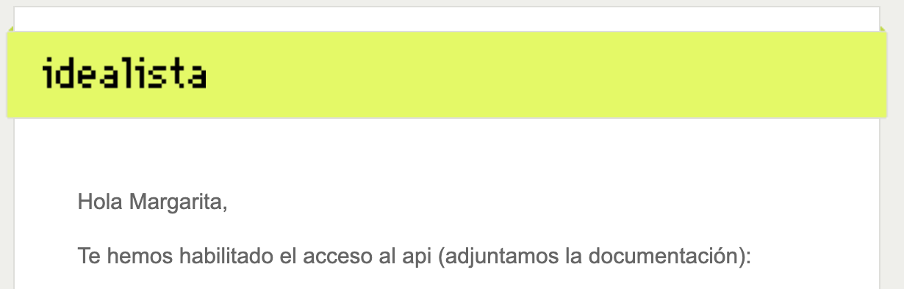

All the data gathered so far comes from [Idealista.com](https://www.idealista.com/). The whole repository is available here [GitHub repo](https://github.com/mbalcerzak/idealista-mongo).


## Raspberry Pi
----

- Scraper set up on a **Raspberry Pi 3B**
- It was being triggered by a **CRONJOB** every day 
- Python script creates JSON with [most interesting flats](https://raw.githubusercontent.com/mbalcerzak/idealista-mongo/mabdata-json/output/latest_price_changes.json) to showcase on the website under ["Flats" tab](https://mabdata.com/flats)

## Scraping
----

Idealista API permits to request 2000 listings per month. You have to request a key [here](https://developers.idealista.com/access-request) to be granted developer access




```python

class BasicParams:
    def __init__(self):
        self.locationId = "0-EU-ES-46"
        self.propertyType = "homes"
        self.order = "publicationDate"
        self.locale = "es"

```

I am looking for an apartment in Valencia ("0-EU-ES-46"). Scraper runs each day in the morning

```bash
source .venv/bin/activate

now=$(date +"%m_%d_%Y")
.venv/bin/python3.9 src/db_mongo.py --pages 20 &> "logs/log_inside_${now}"

```
I am logging the scraper results to check if the run was completed succesfully and see the statistics at the end.

```
Scraped flats: 380

Properties for sale
Inserted: 267, 113 found already in the database. Price changes: 12
```

A Python script runs each day to pick listings with the highest numer of price changes or the ones for which the price got lower most recently. 
```json
{
    "propertyCode": "100002920",
    "prices": [
        410000,
        405000,
        395000,
        394900,
        394800
    ],
    "dates": [
        "2023-01-04",
        "2023-02-01",
        "2023-03-31",
        "2023-09-07",
        "2023-09-13"
    ]
}, ...
```

