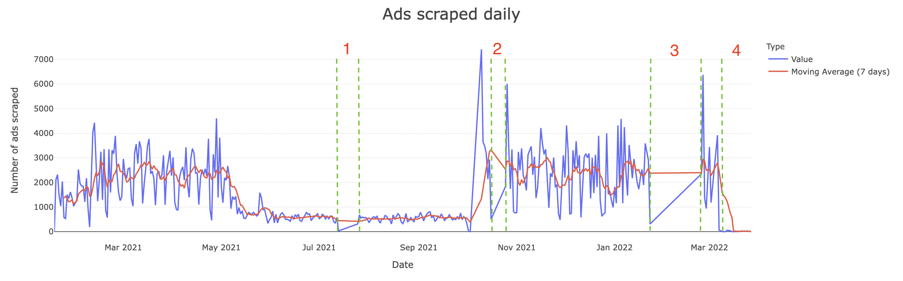

All the data gathered comes from [gumtree.pl](www.gumtree.pl). The whole code is available here [GitHub repo](https://github.com/mbalcerzak/mab_szuka_mieszkania).





## Raspberry Pi

I set up the scraper on a **Raspberry Pi 3B**. It was being triggered by a **CRONJOB** every hour. Initially I made it send me an email every evening with a simple report to check if it works. Every week the scheduled script was uploading an SQLite file on my Google Drive as a **back-up**. 

## Scrapy & BeautifulSoup

```python

import scrapy 


```