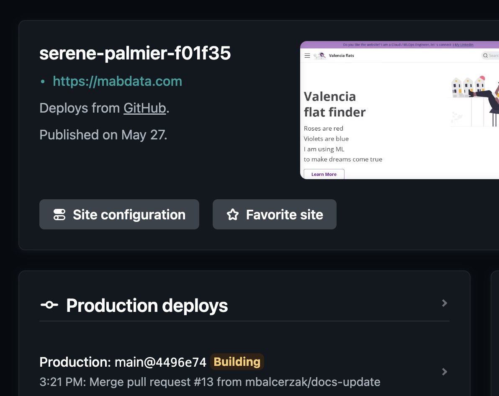
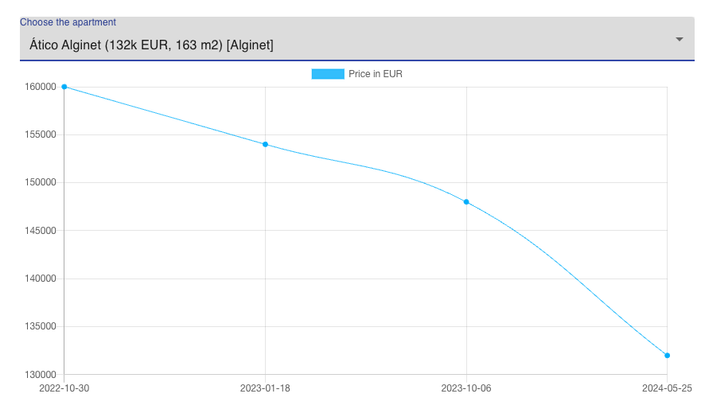

# AWS 

# Hosting - Netlify

I am hosting that website on Netlify. CI/CD setup ensures that each time I merge my changes to main, the new version is immediately deployed.

## The interactive graphs are made with React

