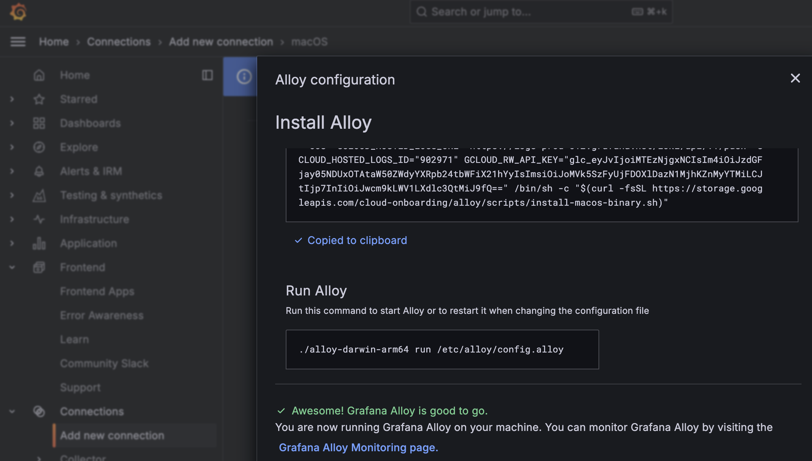
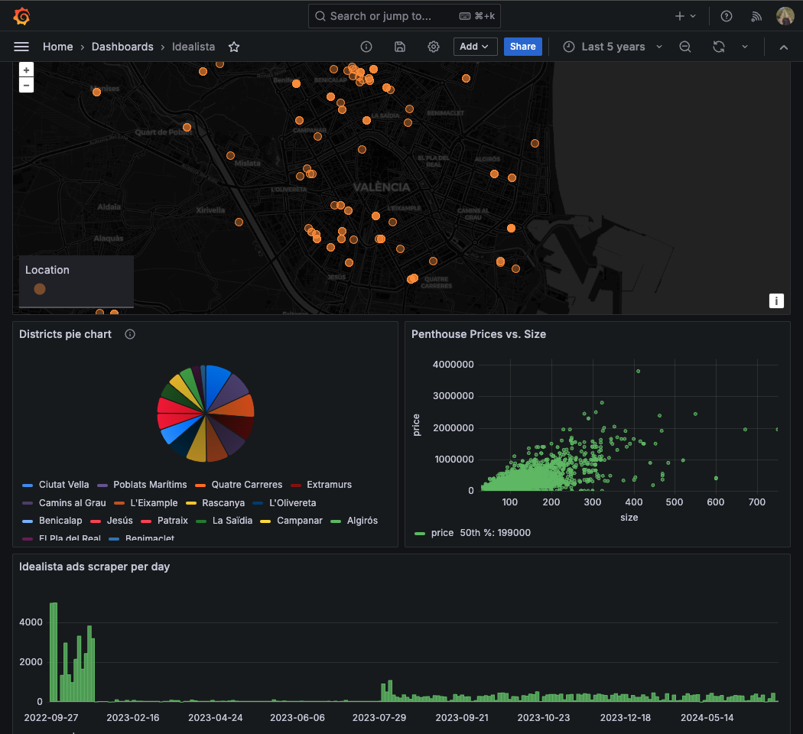

# Logs, alerts, dashboards and metrics

Keeping an eye on machine learning models is super important because it helps to catch any weird behavior or changes in the data early on, ensuring everything runs smoothly. We should make sure the models stay reliable, accurate and fair, so they don't end up being biased. Plus, it helps meet any rules and builds trust by showing how the AI is working :)

Additionally, as amy background is **banking** and **pharamceutical industry**, robust monitoring facilitates compliance with regulatory standards and enhances trust in AI systems by providing transparency and accountability.

## Let's set up Grafana!

A Grafana dashboard provides a powerful visualization of the statistics derived from a database populated with scraped real estate data from Idealista. I included some basic visualisations to play with the tool

Central to this dashboard is a an interactive map pinpointing the locations of newly built penthouses. This geospatial representation not only helps users visualize where the latest high-end developments are situated but also aids in understanding market dynamics and regional growth. Together, these visualizations enable a comprehensive and intuitive analysis of the real estate market, driven by up-to-date and detailed data.

The pie chart presents a clear count of flats available per district, allowing users to quickly identify which areas have the highest concentration of listings. Complementing this is a time series graph that tracks the number of ads scraped each day, offering insights into the data collection process and highlighting trends over time, such as peaks during high listing periods. The data gathering is a bit limited due to Idealista only allowing 2000 requests per month per OAuth key and there are around ~200 new listings per day.

> You can see the dashbard in real-time here [mbalcerzak.grafana.net](https://mbalcerzak.grafana.net/goto/XgRMzyySR?orgId=1)

## MLFlow

MLFlow provides a centralized platform for tracking and managing machine learning experiments, ensuring reproducibility and transparency of results. It simplifies the deployment process by offering tools to package and share models across different environments, facilitating seamless integration into production systems. Additionally, MLFlow supports collaboration among team members by maintaining detailed logs and versions of data, code, and configurations, enhancing team productivity and project coherence.

<!-- ## Ground Truth Evaluation

Most important step is to train ground truth model. In case of this project the label is apartment price. Fortunately in this case the "true" price specified by the owner/agency is available so it's feasible to check the model accuracy real time. 

[] has the model degraded quickly?

Even though price of some apartments changes, overall they make only around 1% of all advertisements published this year. 

New data gets collected and once the performance of the model (evalated on the newly gathered data) drops below a certain threshold, the model needs to be retrained. 

Metrics that would show whether the model is outdated:
- ROC AUC
- log loss
And we should also look at those metrict in subpopulations. 

##  Input Drift Detection

[] Feature drift vs. concept drift 

Data distribution should not diverge too much between the training and testing phases. 

Usually data drift occurs due to the training data collected not representing the target population.  -->